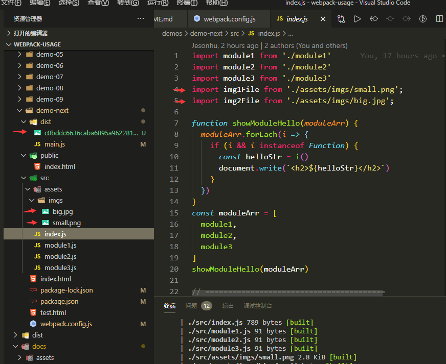
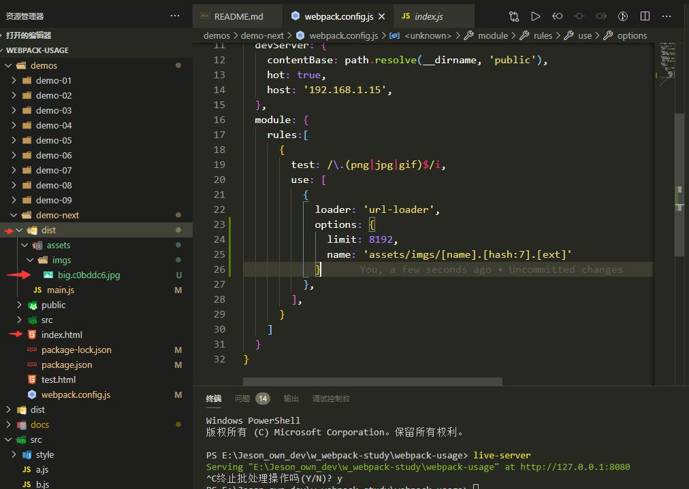
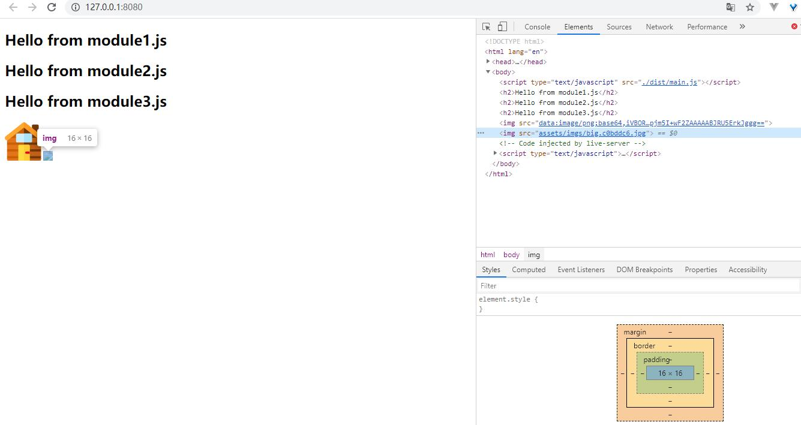

# webpack 使用记录.

## 命令说明

```cmd
webpack-dev-server --open
```
使用 `webpack-dev-server` 开启一个带有热更新的服务。执行这个命令将不会在目录结构生成 output 文件，但是会在内存中生成这个文件。`--open` 每次命令执行都会打开一个新窗口

如果 `webpack.config.js` 中没有配置 `devServer` 属性。生成的文件将位于根目录也就是 `webpack.config.js` 的同级目录.

```cmd
webpack -p
```

根据 webpack.config.js 生成对应的文件.默认在 `./dist` 目录中生成。命令更多说明请点击[这里](https://www.jianshu.com/p/ce4b9d7b9da4)

修改了 `webpack.config.js` 配置文件，需要重启服务才能看到效果

## demo-01: 基本入口文件

> 案例对应的 webpack 版本为 `v4.44.2`

`webpack.config.js` 中是最基础的设置，只设置了 `entry` 与 `output.filename`

## demo-02: 修改目录结构

> 案例对应的 webpack 版本为 `v4.44.2`

将相关代码移动至 `./src` 目录下。对应的 `webpack.config.js` 中的 `entry` 也需要同步修改。

```js
// webpac.config.js
module.exports = {
  entry: './src/index.js',
  output: {
    filename: 'main.js',
    path: path.resolve(__dirname, 'dist')
  }
}
```

## demo-03: 修改 devServer

> 案例对应的 webpack 版本为 `v4.44.2`

```js
// webpac.config.js
module.exports = {
  entry: './src/index.js',
  output: {
    filename: 'main.js',
    path: path.resolve(__dirname, 'dist')
  },
  devServer: {
    contentBase: path.resolve(__dirname, 'public'),
    hot: true,
    host: '192.168.1.15',
    before: function(app, server, compiler) {
      app.get('/some/path1', function(req, res) {
        res.json({ custom: 'response from before' });
      });
    },
    after: function(app, server, compiler) {
      app.get('/some/path2', function(req, res) {
        res.json({ custom: 'response from after' });
      });
    }
  }
}
```

默认 devServer 打开的服务使用的是根目录下面的 `index.html` 在开发中，有时需要自定义 `index.html` 和资源的位置。如上图所示为 `./public/index.html` 文件


```js
//webpack.config.js
devServer: {
  before: function(app, server, compiler) {
    app.get('/some/path1', function(req, res) {
      res.json({ custom: 'response from before' });
    });
  },
  after: function(app, server, compiler) {
    app.get('/some/path2', function(req, res) {
      res.json({ custom: 'response from after' });
    });
  }
}
```
devServer 提供了几个添加中间件的地方。如上面的配置, 在开启服务后地址栏输入 `/some/path1` `/some/path2` 将分别返回对应的设置内容。

```js
devServer: {
  host: '192.168.1.15',
}
```

默认是 `devServer` 打开的host在 `localhost`。这样局域网中的其他设备就无法访问。改成上面的配置，只要在一个局域网中的设备都能访问。


## demo-04: 多入口文件.

```js
// webpack.config.js
const path = require('path')

module.exports = {
  entry: {
    main: './src/index.js',
    vendor: './src/vendor.js'
  },
  output: {
    // filename: 'main.js',
    filename: '[name].bundle.js',
    path: path.resolve(__dirname, 'dist')
  },
  devServer: {
    contentBase: path.resolve(__dirname, 'public'),
    hot: true,
    host: '192.168.1.15'
  }
}
```
当前配置是多个入口文件的配置. 对应的资源引入方式如下所示:

```html
<script type="text/javascript" src="./main.bundle.js"></script>
<script type="text/javascript" src="./vendor.bundle.js"></script>
```

## demo-05: Babel-loader 使用

Babel-loader 基本使用可以查看[文档](github.com/babel/babel-loader)。例如有如下配置

```js
// webpack/config.js
module.exports = {
  module: {
    rules: [
      {
        test: /\.js?$/,
        exclude: /node_modules/,
        use: {
          loader: 'babel-loader',
          options: {
            presets: ['es2015']
          }
        }
      }
    ]
  }
}
```
这种配置需要怎样的依赖呢? `babal-loader` `@babel/core` 是必须要引入的。配置中使用了 `es2015`
因此还需要添加 `babel-preset-es2015`。上面的配置需要的完整依赖命令为：

```cmd
npm install -D babel-loader @babel/core babel-preset-es2015
```

如果是 `presets: ['es2015', 'react']` 还需要引入 `babel-preset-react`

```cmd
npm WARN deprecated babel-preset-es2015@6.24.1: ????  Thanks for using Babel: we recommend using babel-preset-env now: please read https://babeljs.io/env to update!
```
解决方案是将 `babel-preset-es2015` 替换为 `@babel/preset-env`。对应的 webpack 也需要修改 `presets: [@babel/preset-env]`。

由于 `es2015` 废弃的关系。最新使用 `babel-loader` 的依赖命令为

```cmd
npm install -D babel-loader @babel/core @babel/preset-env
```

> 由于 Babel 只转换语法(如箭头函数)， 你可以使用 babel-polyfill 支持新的全局变量，例如 Promise 、新的原生方法如 String.padStart (left-pad) 等。

安装：

```cmd
npm install --save-dev babel-polyfill
在入口文件引入就可以了：
```

```js
// ./src/index.js
import 'babel-polyfill'
```

## demo-06: CSS-loader 基本用法

通过 Webpack 我们可以在JS中使用CSS。一般通过 CSS-loader 处理 CSS 文件。

一般需要安装两个loader:

  + style-loader: 将 JS 字符串生成为 style 节点
  + css-loader: 将 CSS 转化成 CommonJS 模块.

```cmd
npm i css-loader style-loader -D
```

webpack.config.js

```js
const path = require('path')

module.exports = {
  entry: {
    main: './src/index.js',
  },
  output: {
    filename: 'main.js',
    path: path.resolve(__dirname, 'dist')
  },
  devServer: {
    contentBase: path.resolve(__dirname, 'public'),
    hot: true,
    host: '192.168.1.15',
  },
  module: {
    rules:[
      {
        test: /\.css$/,
        use: [ 'style-loader', 'css-loader' ]
      },
    ]
  }
}
```

仅使用 css-loader 与 style-loader 。`npm run build` 后的 css 定义将放在 `output` 文件中。并在 HTML 中插入 `<style>` 及样式.

## demo-07: less-loader 基本用法

css 预处理器 `less` `scss` `stylus` 在项目开发中比较常见。当前介绍 `less` 的使用。主要通过 [less-loader](https://www.webpackjs.com/loaders/less-loader/) 处理 `less`

```cmd
npm i less less-loader -D
```

webpack.config.js

```js
const path = require('path')

module.exports = {
  entry: {
    main: './src/index.js',
  },
  output: {
    filename: 'main.js',
    path: path.resolve(__dirname, 'dist')
  },
  devServer: {
    contentBase: path.resolve(__dirname, 'public'),
    hot: true,
    host: '192.168.1.15',
  },
  module: {
    rules:[
      {
        test: /\.less$/,
        use: [
          { loader: 'style-loader' },
          { loader: 'css-loader' },
          {
            loader: 'less-loader'
          }
        ]
      }
    ]
  }
}
```
处理过程 css 类似。只是多了一步 `.less` 编译为 `.css` 文件

## demo-08: sass-loader 基本用法

相关依赖

```cmd
npm install sass-loader node-sass webpack --save-dev
```

注意: 不需要安装 `sass`

webpack.config.js

```js
const path = require('path')

module.exports = {
  entry: {
    main: './src/index.js',
  },
  output: {
    filename: 'main.js',
    path: path.resolve(__dirname, 'dist')
  },
  devServer: {
    contentBase: path.resolve(__dirname, 'public'),
    hot: true,
    host: '192.168.1.15',
  },
  module: {
    rules:[
      {
        test: /\.scss$/,
        use: [
          { loader: 'style-loader' },
          { loader: 'css-loader' },
          {
            loader: 'sass-loader'
          }
        ]
      }
    ]
  }
}
```

## demo-09: stylus-loader 基本用法

需要依赖

```cmd
npm i stylus stylus-loader -D
```

webpack.config.js

```js
const path = require('path')

module.exports = {
  entry: {
    main: './src/index.js',
  },
  output: {
    filename: 'main.js',
    path: path.resolve(__dirname, 'dist')
  },
  devServer: {
    contentBase: path.resolve(__dirname, 'public'),
    hot: true,
    host: '192.168.1.15',
  },
  module: {
    rules:[
      {
        test: /\.styl$/,
        use: [
          { loader: 'style-loader' },
          { loader: 'css-loader' },
          {
            loader: 'stylus-loader'
          }
        ]
      }
    ]
  }
}
```

## demo-10: url-loader 用法

url-loader 主要用来处理图片，依赖如下

```cmd
npm i url-loader -D
```

webpack.config.js
```js
const path = require('path')

module.exports = {
  entry: {
    main: './src/index.js',
  },
  output: {
    filename: 'main.js',
    path: path.resolve(__dirname, 'dist')
  },
  devServer: {
    contentBase: path.resolve(__dirname, 'public'),
    hot: true,
    host: '192.168.1.15',
  },
  module: {
    rules:[
      {
        test: /\.(png|jpg|gif)$/i,
        use: [
          {
            loader: 'url-loader',
          },
        ],
      }
    ]
  }
}
```

entry js

```js
import img1File from './assets/imgs/small.png';
import img2File from './assets/imgs/big.jpg';

const oImg1 = document.createElement('img')
oImg1.src = img1File
const oImg2 = document.createElement('img')
oImg2.src = img2File
document.body.appendChild(oImg1)
document.body.appendChild(oImg2)
```

```js
const oImg1 = document.createElement('img')
oImg1.src = './assets/imgs/small.png'
```
这种方式图片没有作为模块使用。webpack 将会把路径当做纯字符串，不会做转换处理。

图片会被转换为 `base64` 格式方式在页面中使用.

处理css中的图片资源时，我们常用的两种loader是file-loader或者url-loader，两者的主要差异在于。url-loader可以设置图片大小限制，当图片超过限制时，其表现行为等同于file-loader，而当图片不超过限制时，则会将图片以base64的形式打包进css文件，以减少请求次数。

如果配置了 options.limit 如果图片超过了限制表现行为就等同于 file-loader. 这时我们就需要安装 `file-loader` 依赖到开发环境中。

```js
module: {
  rules:[
    {
      test: /\.(png|jpg|gif)$/i,
      use: [
        {
          loader: 'url-loader',
          options: {
            limit: 8192,
          },
        },
      ],
    }
  ]
}
```

*limit: 10,限制 图片大小 10B，小于限制会将图片转换为 base64格式*

我们知道当使用 `url-loader` 且为设置 `limit` 时会将所有的图片都打包为 `base64` 格式。这种方式开发模式和生产模式都是没有问题的。因为图片已经被转换为了 `base64` 的字符串放在了 output 的 js 文件中。

由于 `base64` 存在利弊，在实际开发中往往设置 `limt`。这样超出尺寸的图片将会通过路径的方式使用源图。例如如下 webpack.config.js 配置:

```js
module: {
  rules:[
    {
      test: /\.(png|jpg|gif)$/i,
      use: [
        {
          loader: 'url-loader',
          options: {
            limit: 8192,
          },
        },
      ],
    }
  ]
}
```

示例中的 `big.jpg` 将会通过地址方式引入。在 `num run build` 运行是发现这张图片地址引入错误的问题。



下面来解决这个问题。回顾图片引入的方式:

```js
import img1File from './assets/imgs/small.png';
```
所以理想的方式是在 `dist` 目录下生成 `/dist/assets/imgs` 目录。并将图片拷贝过去。下面我们朝着这个方向修改。

+ **添加 name**

webpack.config.js
```js
const path = require('path')

module.exports = {
  entry: {
    main: './src/index.js',
  },
  output: {
    filename: 'main.js',
    path: path.resolve(__dirname, 'dist')
  },
  devServer: {
    contentBase: path.resolve(__dirname, 'public'),
    hot: true,
    host: '192.168.1.15',
  },
  module: {
    rules:[
      {
        test: /\.(png|jpg|gif)$/i,
        use: [
          {
            loader: 'url-loader',
            options: {
              limit: 8192,
              name: 'assets/imgs/[name].[hash:7].[ext]'
            }
          },
        ],
      }
    ]
  }
}
```

index.js

```js
import img1File from './assets/imgs/small.png';
import img2File from './assets/imgs/big.jpg';
```
下面来看看 `build` 后的结果:



生产环境中依旧报错, 来分析下报错的原因: `index.html` 位于根目录。访问 `/dist` 目录下面的资源都必须带上 `./dist` 或者 `/dist`, 缺少了这个域所以报错了。

配置文件复制图片是相对于 webpack 出口路径的。已将出口路径配置为 `/dist/main.js` 。而 index.html 却不在 `/dist` 中。解决这个问题有两个方向:

+ 方案1: `index.html` 移动到 `/dist` 中。这个在后续的 loader 中可以实现。
+ 方案2: 不移动 `index.html` 位置。配置 `publicPath`

webpack.config.js

```js
const path = require('path')

const outFilePublicPath = typeof process.env.NODE_ENV !== 'undefined' && process.env.NODE_ENV === "production" 
  ? './dist'
  : ''
  
module.exports = {
  entry: {
    main: './src/index.js',
  },
  output: {
    filename: 'main.js',
    path: path.resolve(__dirname, 'dist')
  },
  devServer: {
    contentBase: path.resolve(__dirname, 'public'),
    hot: true,
    host: '192.168.1.15',
  },
  module: {
    rules:[
      {
        test: /\.(png|jpg|gif)$/i,
        use: [
          {
            loader: 'url-loader',
            options: {
              limit: 8192,
              name: 'assets/imgs/[name].[hash:7].[ext]',
              publicPath: outFilePublicPath
            }
          },
        ],
      }
    ]
  }
}
```
`index.html` 放在根目录。`build` 后图片资源也正常了。这里有一个 `process.env` 的坑，通过 `cross-env` 解决的。


## demo-11: 拆分 css

当前 css 也是放在 js 文件中。有时需要单独拆分到 css 文件。目前可以通过 [extract-loader](https://www.webpackjs.com/loaders/extract-loader/) 或 ~~[extract-text-webpack-plugin](https://www.webpackjs.com/plugins/extract-text-webpack-plugin/)~~ [mini-css-extract-plugin](https://www.npmjs.com/package/mini-css-extract-plugin) 实现。本示例使用 `mini-css-extract-plugin`。目前只有在webpack V4版本才支持使用该插件

这个插件应该只在生产环境构建中使用，并且在loader链中不应该有style-loader，特别是我们在开发模式中使用HMR时。 所以开发环境 `style-loader` 生产环境: `mini-css-extract-plugin`

1.1 mini-css-extract-plugin

webpack.config.js
```js
const path = require('path')
const MiniCssExtractPlugin = require('mini-css-extract-plugin');

const isDevMode = process.env.NODE_ENV !== 'production'

const outFilePublicPath = !isDevMode ? './dist' : ''

// 开发环境 style-loader 与生产环境 MiniCssExtractPlugin 配置
const cssUseConfig = () => {
  if (isDevMode) {
    return {
      loader: 'style-loader'
    }
  } else {
    return {
      loader: MiniCssExtractPlugin.loader,
      options: {
        publicPath: './dist'
      }
    }
  }
}

module.exports = {
  entry: {
    main: './src/index.js',
  },
  output: {
    filename: 'main.js',
    path: path.resolve(__dirname, 'dist')
  },
  devServer: {
    contentBase: path.resolve(__dirname, 'public'),
    hot: true,
    host: '192.168.1.15',
  },
  plugins: [
    new MiniCssExtractPlugin({
      filename: isDevMode ? 'assets/css/[name].css' : 'assets/css/[name].[hash:7].css',
      chunkFilename: isDevMode ? '[id].css' : '[id].[hash:7].css',
    })
  ],
  module: {
    rules:[
      {
        test: /\.css$/,
        use: [
          cssUseConfig(),
          { loader: 'css-loader' }
        ]
      }
    ]
  }
}
```
当前配置实现了:

+ 开发环境使用 style-loader
+ 生产环境使用 `MiniCssExtractPlugin`。
+ 自定义编译后的 `css` 位置。是通过 实例化 `new MiniCssExtractPlugin` 时。设置 `filename` 实现的。


src/index.js

```js
import './assets/css/index.css'
import './style.css'
```

当前配置 build 后的 `./dist/assets/css/main.*.css` 中将包含所有使用的样式.

**提取公共部分 CSS: optimization**

what？
当我们在编写多入口文件的项目时，难免在不同的入口文件会有相同的部分（比如说存在部分相同的样式，使用了相同的组件，使用了公共样式等等），因此我们需要在打包过程中提取公共的部分并独立开来。
在之前版本的webpack中，我们可以使用CommonsChunkPlugin 进行提取，而在webpack4+版本，CommonsChunkPlugin 已经从 webpack v4 legato 中移除，webpack 4+ 版本使用内置的 SplitChunksPlugin 插件来进行公共部分的提取

use？
因为 SplitChunksPlugin 是 webpack 4+ 版本内置的插件, 所以无需安装, 只需在 webpack.config.js 中配置：

```js
entry: {
  main: './src/index.js',
  vendor2: './src/index2.js',
  vendor3: './src/index3.js',
},
output: {
  filename: '[name].js',
  path: path.resolve(__dirname, 'dist')
},
optimization: {
  splitChunks: {
    cacheGroups: {
      commons: {
        name: 'common',    //提取出来的文件命名
        chunks: 'initial',  //initial表示提取入口文件的公共部分
        minChunks: 2,       //表示提取公共部分最少的文件数
        minSize: 0          //表示提取公共部分最小的大小
      }
    }
  },
}
```

index2.js

```js
import './assets/css/common.css'
```

index3.js

```js
import './assets/css/common.css'
```

build 后 `./dist/assets/css` 中将生成两个css文件 `main.css` 和 `公共样式文件`

## demo-12: 图片处理

前面处理了 js 中 图片的使用。下面来处理 css 中图片的使用。以及两者同时使用的情况.

+ 图片的使用方式有以下三种:
  + HTML 中使用图片
  + JS 中使用图片
  + CSS 中使用图片

```js
const oImg1 = document.createElement('img')
oImg1.src = './assets/imgs/small.png'
```
这种方式图片没有作为模块使用。webpack 将会把路径当做纯字符串，不会做转换处理。

+ `url-loader`: 默认配置时会将所有的图片(html中，css中)全部转换为 `base64` 字符串, 当配置了 `limit` 超过限制
的图片将会交给 `file-loader` 处理。因此需要安装 `css-loader、file-loader`
+ `file-loader`: 将使用的图片拷贝至输出目录。
+ html-withImg-loader: 处理 HTML 中的图片路径。

**1. html-withimg-loader 使用**

安装
```cmd
npm install html-withimg-loader --save
```

使用
```
var html = require('html-withimg-loader!../xxx.html');
```
或者写到配置中：
```js
loaders: [
    {
        test: /\.(htm|html)$/i,
        loader: 'html-withimg-loader'
    }
]
```
!!! 测试发现html中的图片可以正常处理，但是 `<%= htmlWebpackPlugin.options.title %>` 失效了。在开发中也要避免html直接使用
图片方式。可以通过 JS 中创建图片，然后插入 dom 中规避掉这种方式.

**2. 使用绝对路径**

+ 优势: 地址处理较简单
+ 劣势: ~~必须放在站点根目录访问.即 `//test.com/assets/img/*.jpg`~~

CSS: 打包前

```css
.small_img_wrap {
  background-image: url('../imgs/small_clock.png');
}

.big_img_wrap {
  background-image: url('../imgs/big_dragon.jpg');
}
```

js: 打包前
```js
import img1File from './assets/imgs/small.png';
import img2File from './assets/imgs/big.jpg';

const oImg1 = document.createElement('img')
oImg1.src = img1File
const oImg2 = document.createElement('img')
oImg2.src = img2File
document.body.appendChild(oImg1)
document.body.appendChild(oImg2)
```

webpack.config.js 配置

```js
const path = require('path')
const MiniCssExtractPlugin = require('mini-css-extract-plugin');

const isDevMode = process.env.NODE_ENV !== 'production'

// 绝对路径
const outFilePublicPath = !isDevMode ? 'http://127.0.0.1:8080/dist/assets/img/' : ''

// 开发环境 style-loader 与生产环境 MiniCssExtractPlugin 配置
const cssUseConfig = () => {
  if (isDevMode) {
    return {
      loader: 'style-loader'
    }
  } else {
    return {
      loader: MiniCssExtractPlugin.loader,
      options: {
        publicPath: '../imgs/',
        outputPath: 'assets/css/'
      }
    }
  }
}

module.exports = {
  entry: {
    main: './src/index.js',
  },
  output: {
    filename: '[name].js',
    path: path.resolve(__dirname, 'dist')
  },
  devServer: {
    contentBase: path.resolve(__dirname, 'public'),
    hot: true,
    host: '192.168.1.15',
  },
  plugins: [
    new MiniCssExtractPlugin({
      filename: isDevMode ? 'assets/css/[name].css' : 'assets/css/[name].[hash:7].css',
      chunkFilename: isDevMode ? 'assets/css/[id].css' : 'assets/css/[id].[hash:7].css',
    })
  ],
  module: {
    rules:[
      {
        test: /\.css$/,
        use: [
          cssUseConfig(),
          { loader: 'css-loader' }
        ]
      },
      {
        test: /\.(png|jpg|gif)$/i,
        use: [
          {
            loader: 'url-loader',
            options: {
              limit: 8192,
              name: '[name].[hash:7].[ext]',
              publicPath: outFilePublicPath,
              outputPath: 'assets/img/',
            }
          },
        ],
      }
    ]
  }
}
```
图片的loader中的 `publicPath` 配置成了绝对路径 `http://127.0.0.1:8080/dist/assets/img/`

CSS：打包后

```css
.big_img_wrap {
  background-image: url(http://127.0.0.1:8080/dist/assets/img/big_dragon.5d0125e.jpg);
}
```

JS 方式创建的元素图片地址: 打包后
```html

```

当图片需要通过CDN等方式引入时比较适合这种方式。也解决了资源必须放在根目录的问题。下面来看看对所有的资源都添加绝对路径:

webpack.config.js
```js
output: {
  filename: '[name].js',
  path: path.resolve(__dirname, 'dist'),
  publicPath: isDevMode ? '' : 'http://127.0.0.1:8080/dist/'
}
```
这种方式一般是所有资源都通过 CDN 方式引入时需要.

**3. 使用相对路径**

+ 优势: 只要将资源放置在 index.html 所在的文件夹目录下就行。例如 `//test.com/sites/aaa/index.html` `//test.com/sites/aaa/assets/img/*.jpg`, 
PS: 截止目前绝对路径也不一定需要放在根目录。
+ 劣势: 这时候就需要将 Html 中的图片路径与 CSS 中的图片路径进行不同的处理。

## demo-13: 复制 html 

build 后往往需要将模板 `index.html` 拷贝到发布目录，并且引入当前生成的资源路径。这时就可以通过
`html-webpack-plugin` 实现。安装:

```cmd
npm i html-webpack-plugin -D
```

webpack.config.js
```js
const path = require('path')
const MiniCssExtractPlugin = require('mini-css-extract-plugin');
const HtmlWebpackPlugin = require('html-webpack-plugin');
const pkgConfig = require('./package.json')

const isDevMode = process.env.NODE_ENV !== 'production'

// 绝对路径
const outFilePublicPath = !isDevMode ? '/assets/imgs/' : ''

// 开发环境 style-loader 与生产环境 MiniCssExtractPlugin 配置
const cssUseConfig = () => {
  if (isDevMode) {
    return {
      loader: 'style-loader'
    }
  } else {
    return {
      loader: MiniCssExtractPlugin.loader,
      options: {
        publicPath: '../imgs/',
        outputPath: 'assets/css/'
      }
    }
  }
}

module.exports = {
  entry: {
    main: './src/index.js',
  },
  output: {
    filename: '[name].js',
    path: path.resolve(__dirname, 'dist')
  },
  plugins: [
    new HtmlWebpackPlugin({
      title: pkgConfig.name,
      template: './index.html', // 模板文件位置
      filename: 'index.html',   // 打包后生成的文件
      hash: true,               // 添加 hash 值解决缓存问题
      minify: {
        removeAttributeQuotes: true,  // 删除属性双引号
        collapseWhitespace: true      // 折叠空行变成一行
      }
    }),
    new HtmlWebpackPlugin({     // 生成 debug.html
      title: `Debug Page - ` + pkgConfig.name,
      template: './index.html', // 模板文件位置
      filename: 'debug.html',   // 打包后生成的文件
      hash: false,              // 添加 hash 值解决缓存问题
      minify: {
        removeAttributeQuotes: false,  // 删除属性双引号
        collapseWhitespace: false      // 折叠空行变成一行
      }
    }),
    new MiniCssExtractPlugin({
      filename: isDevMode ? 'assets/css/[name].css' : 'assets/css/[name].[hash:7].css',
      chunkFilename: isDevMode ? 'assets/css/[id].css' : 'assets/css/[id].[hash:7].css',
    })
  ],
  optimization: {
    splitChunks: {
      cacheGroups: {
        commons: {
          name: 'common',    //提取出来的文件命名
          chunks: 'initial',  //initial表示提取入口文件的公共部分
          minChunks: 2,       //表示提取公共部分最少的文件数
          minSize: 0          //表示提取公共部分最小的大小
        }
      }
    },
  },
  module: {
    rules:[
      {
        test: /\.css$/,
        use: [
          cssUseConfig(),
          { loader: 'css-loader' }
        ]
      },
      {
        test: /\.(png|jpg|gif)$/i,
        use: [
          {
            loader: 'url-loader',
            options: {
              limit: 8192,
              name: '[name].[hash:7].[ext]',
              publicPath: outFilePublicPath,
              outputPath: 'assets/img/',
            }
          },
        ],
      }
    ]
  }
}
```


## demo-14: 删除之前的打包目录.

多次打包时，默认之前的文件是不会删除的。名字相同则覆盖，不同则保留。如果需要删除之前打包后资源。这时就需要 `clean-webpack-plugin` 。依赖安装:

```cmd
npm install clean-webpack-plugin -D
```

webpack.config.js
```js
const { CleanWebpackPlugin } = require('clean-webpack-plugin');

module.exports = {
  plugins: [
    new CleanWebpackPlugin()
  ]
}
```

## demo-15: 导出全局变量.

什么叫全局变量? 浏览器环境中暴露在 window 对象下的变量。
比较典型的 `jQuery` 的使用。需要对外暴露一个全局变量 `$`, 即可以通过 `window.$` 或 `windwo.jQuery` 访问。

下面先说下模块方式的使用:

```js
// *.js
import $ from 'jquery'
console.log($)
```

这种方式是通过模块方式使用 `jquery`, 此方式可以直接使用。但是 `window.$` 或 `window.jquery` 方式却无法使用。目前我们需要全局方式使用。

loader 目前分4种方式使用:

+ 1. pre: 在前面执行的 loader
+ 2. normal: 普通的 loader
+ 3. 内联: 内联的 loader, 基本语法 `expose?{暴露符号}!{模块名}`。例如 `import $ from 'expose-loader?exposes[]=$!jquery`。
是暴露一个符号 `$`(window.$) 并作为 `jquery` 使用
+ 4. 后置: 后置的 loader


**方式1: 使用 [expose-loader](https://www.webpackjs.com/loaders/expose-loader/) 处理**

安装
```cmd
npm i expose-loader
```
需要注意的是，当前插件需要在生产环境使用，所以安装时不使用 `--save-dev` 或 `-D`, 详细使用可以点击[这里](https://www.npmjs.com/package/expose-loader)

**1.1 expose-loader 内联方式**

入口 js
```js
// 引入
import jquery from 'expose-loader?exposes[]=$&exposes[]=jQuery!jquery';

// 使用
console.log('===== window.$', window.$)
console.log('===== window.jQuery', window.jQuery)
```
以上方式不需要配置 `webpack`。通过 `exposes[]=$&exposes[]=jQuery` 方式暴露 `window.$` `window.jQuery`

**1.2 使用配置方式**

webpack.config.js
```js
module: {
  rules:[
    // @see https://www.npmjs.com/package/expose-loader#using-configuration
    {
      test: require.resolve('jquery'),
      use: [
        {
          loader: 'expose-loader',
          options: {
            exposes: ['$', 'jQuery'],
          },
        }
      ]
    }
  ]
}
```

使用
```js
import jquery from 'jquery';

// ========================================
// 全局 jquery
// ========================================
console.log('===== window.$', window.$)
console.log('===== window.jQuery', window.jQuery)
```
通过配置 webpack 可以在生产环境中使用 `window.$` 或 `window.jQuery`

**1.3 模块中注入 jQuery**

```js
console.log($)
```
即每个模块中在未引入的情况下，直接使用 `$`, 这时可以通过webpack在每个插件中注入 `$` 实现。
对应的配置如下:

webpack.config.js 
```js
const webpack = require('webpack')

plugins: [
  new webpack.ProvidePlugin({        // 在每个模块中注入$
    $: 'jquery'
  })
]
```

使用
```js
// 只能在模块中使用 $, window.$ 是无效的
console.log('===== module jquery', $)
```

**1.4.1 CDN方式引入jQuery**

index.html
```html
<script src="https://cdn.bootcdn.net/ajax/libs/jquery/3.5.1/jquery.min.js"></script>
```

使用
```js
console.log($)
console.log(jQuery)
console.log('===== window.$', window.$)
console.log('===== window.jQuery', window.jQuery)
```
这种方式也是可以的, 但需要注意的是，使用这种方式时模块可以不再重复引入 `jQuery` 或者注入 `jQuery`.

**1.4.2 CDN 方式优化**

使用CDN 引入 jQuery，打包时忽略 jQuery 模块

使用
```js
import jQuery from 'jquery'

console.log($)
console.log(jQuery)
console.log('===== window.$', window.$)
console.log('===== window.jQuery', window.jQuery)
```
在build后的资源会发现，`jQuery` 的资源被打包了进去。但是此时是通过 CDN 方式使用的。打包时可以忽略掉 `jQuery` 的内容。
此时可以通过如下配置实现:

webpack.config.js
```js
module.exports = {
  externals: {
    jquery: 'jQuery'    // 打包时忽略 jQuery
  }
}
```
再重新打包后发现打包后的JS文件已经少了 `jQuery` 的内容

**所以截止目前可以做一个总结，有三种方式引入第三方模块**:

+ expose-loader: 暴露全局变量
+ webpack.ProvidePlugin: 每个模块注入方式
+ script 标签: CDN 方式

## demo-16: 抽取公共 js 与 vendor js

+ 公共js: 基于项目开发，需要多个地方都使用的js
+ vendor js: 第三方类库js。例如 jquery、lodash。通常来自于 `node_modules`

!!!注意: 需要多页文件，且每个入口中的文件都引入这个模块时才会将代码进行拆分

webpack.config.js
```js
module.exports = {
  entry: {
    main: './src/index.js',
    main2: './src/index2.js'
  },
  output: {
    filename: '[name].js',
    path: path.resolve(__dirname, 'dist')
  },
  optimization: {
    splitChunks: {                // 分割代码块 
      cacheGroups: {              // 缓存组
        commons: {                // 公共的模块
          name: 'common',         // 提取出来的文件命名
          chunks: 'initial',      // initial表示提取入口文件的公共部分
          minChunks: 2,           // 表示提取公共部分最少的文件数
          minSize: 0              // 表示提取公共部分最小的大小
        },
        vendor: {                 // 第三方资源
          test: /node_modules/,   // 从 node_modules 中来的资源就作为vendor资源.
          chunks: 'initial',      // initial表示提取入口文件的公共部分
          minChunks: 2,           // 表示提取公共部分最少的文件数
          minSize: 0  
        },
      }
    },
  }
}
```

入口1:
```js
// index.js
import module1 from './module1'
import module2 from './module2'
import module3 from './module3'
import jquery from 'jquery'
import './common'

// ========================================
// 全局 jquery
// ========================================
console.log('===== module jquery', jquery)
console.log('===== window.$', window.$)
console.log('===== window.jQuery', window.jQuery)
```

入口2:
```js
// index2.js
import './common'
import './module2_2'
console.log('Hello from index2.js')

// module2_2.js
import jquery from 'jquery'

console.log('hello jquery from module1', jquery)
```

公共部分

```js
// common.js
console.log('这是项目公共部分内容')
```

打包后将生成 `/dist/common.js` 里面的内容为 `common.js` 与 `jquery.js` 的代码。再来看看
webpack.config.js 相关部分的配置

```js
optimization: {
  splitChunks: {                // 分割代码块 
    cacheGroups: {              // 缓存组
      commons: {                // 公共的模块
        name: 'common',         // 提取出来的文件命名
        chunks: 'initial',      // initial表示提取入口文件的公共部分
        minChunks: 2,           // 表示提取公共部分最少的文件数
        minSize: 0              // 表示提取公共部分最小的大小
      },
      vendor: {                 // 第三方资源
        test: /node_modules/,   // 从 node_modules 中来的资源就作为vendor资源.
        chunks: 'initial',      // initial表示提取入口文件的公共部分
        minChunks: 2,           // 表示提取公共部分最少的文件数
        minSize: 0  
      },
    }
  },
}
```
这样配置 `cacheGroups.vendor` 的配置将会失效。因为 `cacheGroups.commons` 先执行，于是先抽离代码，下面的就
失效了。这就是打包后的 `/dist/common.js` 出现 `common.js` 与 `jquery.js` 代码的原因。有时需要的是
`jquery.js` 的内容放置到 `vendor` 中与 `/src/common.js` 中的代码分离。此时可以通过添加优先级 `priority` 
处理。下面是添加优先级后的配置:

```js
optimization: {
  splitChunks: {                // 分割代码块 
    cacheGroups: {              // 缓存组
      commons: {                // 公共的模块
        name: 'common',         // 提取出来的文件命名
        chunks: 'initial',      // initial表示提取入口文件的公共部分
        minChunks: 2,           // 表示提取公共部分最少的文件数
        minSize: 0              // 表示提取公共部分最小的大小
      },
      vendor: {                 // 第三方资源
        test: /node_modules/,   // 从 node_modules 中来的资源就作为vendor资源.
        name: 'vendor',         // 提取出来的文件名
        priority: 1,            // 添加优先级，在 cacheGroups.common 之前执行
        chunks: 'initial',      // initial表示提取入口文件的公共部分
        minChunks: 2,           // 表示提取公共部分最少的文件数
        minSize: 0  
      },
    }
  },
}
```


## Todo

+ js: ~~分包~~，压缩，混淆
+ css: ~~拆分~~，压缩, 浏览器兼容
+ 图片的使用方式有以下三种:
  + HTML 中使用图片
  + JS 中使用图片
  + CSS 中使用图片
+ webpack.config.js 拆分到 `/config/webpack.dev.js` `/config/webpack.prod.js`

```js
// config/webpack.dev.js
// config/webpack.prod.js
```

```cmd
"scripts": {
  "dev": "cross-env NODE_ENV=development webpack-dev-server --open --hot --progress --config ./config/webpack.dev.js",
  "build": "cross-env NODE_ENV=production webpack --progress --config ./config/webpack.prod.js"
},
```

## 参考文档

+ [ruanyf/webpack-demos](https://github.com/ruanyf/webpack-demos): 有很多案例可以查看
+ [webpack4系列教程（七）：使用 babel-loader](https://www.jianshu.com/p/d971bffff546): 介绍 webpack 如何使用 `babel-loader`。懒加载 `.babelrc` 设置
+ [less-loader-docs](https://www.webpackjs.com/loaders/less-loader/): webpack官方 less-loader 使用文档
+ [sass-loader-docs](https://www.webpackjs.com/loaders/sass-loader/):  webpack官方 sass-loader 使用文档
+ [stylus-loader-docs](https://webpack.js.org/loaders/stylus-loader/): webpack官方 stylus-loader 使用文档
+ [url-loader-docs](https://webpack.js.org/loaders/url-loader/): webpack官方 url-loader 使用文档
+ [webpack url-loader limit 转换部分资源为base64格式 其余不转换](https://segmentfault.com/a/1190000017745449)
+ [webpack4环境配置之process.env](https://www.jianshu.com/p/19d199f93045): webpack4 process.env 配置.
+ [extract-text-webpack-plugin](https://www.webpackjs.com/plugins/extract-text-webpack-plugin/): css 拆分, 已废弃推荐使用 mini-css-extract-plugin
+ [extract-loader](https://www.webpackjs.com/loaders/extract-loader/): css 拆分
+ [mini-css-extract-plugin](https://www.npmjs.com/package/mini-css-extract-plugin): css 拆分
+ [mini-css-extract-plugin简介](https://www.cnblogs.com/blackgan/p/10590540.html): mini-css-extract-plugin 使用介绍
+ [webpack学习（五）：webpack4+压缩和提取CSS以及提取公共部分](https://blog.csdn.net/weixin_40184174/article/details/85125388): 公共 css 拆分。webpack.config.js 拆分
+ [webpack4.x中关于css-loader的几个坑](https://blog.csdn.net/lqlqlq007/article/details/84031800): debug, css-loader 中图片路径转换
+ [debug: url-loader处理css中的图片资源遇到的问题](https://www.jianshu.com/p/3429cd456982): debug, css-loader 中图片路径转换
+ [html-webpack-plugin](https://www.npmjs.com/package/html-webpack-plugin): 模板拷贝和自定义内容 loader
+ [clean-webpack-plugin](https://www.npmjs.com/package/clean-webpack-plugin): 删除打包的目录
+ [expose-loader](https://www.webpackjs.com/loaders/expose-loader/): 官方文档 expose-loader 基本使用
<<<<<<< HEAD
+ [externals](https://webpack.docschina.org/configuration/externals/): 让webpack 忽略某些模块包
+ [html-withimg-loader](https://github.com/wzsxyz/html-withimg-loader): 打包 html 中的图片，另外还可以学习 webpack-loader 的写法.
=======
+ [copy-webpack-plugin](https://www.npmjs.com/package/copy-webpack-plugin): 复制资源到指定目录插件。[双面人](https://gitee.com/weblife/demo-shuangmianren)案例使用了此插件
>>>>>>> b1173d7aa88e2657ab5af9bc39ad36b4e5d37da8
